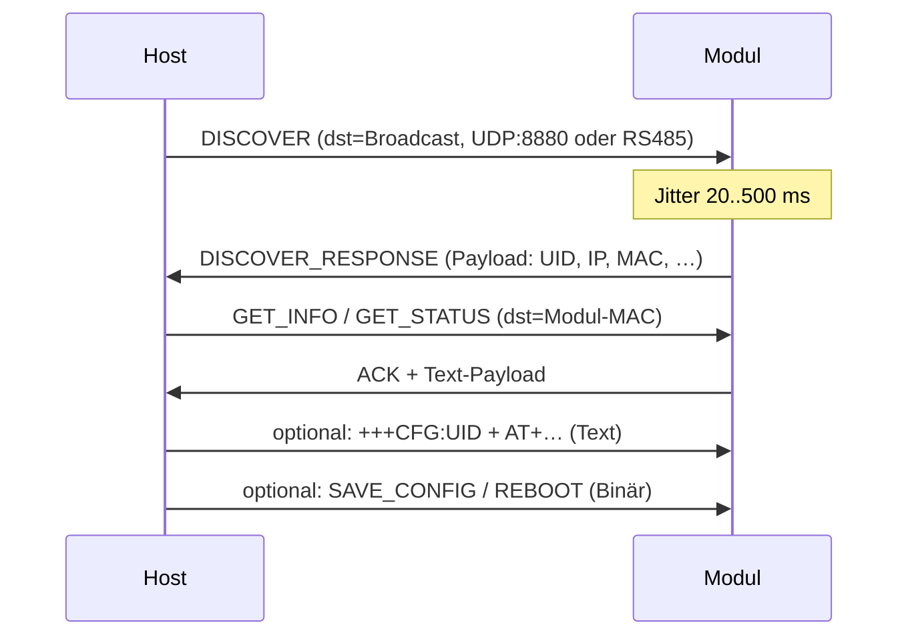

# AT-Kommandos & Discovery — DK8DE WLAN_to_RS485 Modul

Stand: Firmware **1.4.0** · Quellen: `src/at_command.cpp`, `src/config_frame.cpp`, `src/config_handlers.cpp`

Dokumentation der **AT-Befehle** sowie des **Binär-Discovery/Config-Protokolls** (UDP **8880** und RS485) — gleicher Frame-Codec auf beiden Wegen.

---

## Transport

| Weg | Beschreibung |
|-----|--------------|
| **RS485 / UART0** | 115200 8N1 — gleicher Port wie Nutzdaten-Bridge |
| **UDP 8880** | Unicast an Modul-IP (STA oder SoftAP); Antworten an den gleichen Peer |

AT wird **nicht** im transparenten TCP/UDP-Datenkanal (Standard-Port **8886**) ausgewertet.

---

## Anmeldung / Authentifizierung

**Nein** — für AT-Befehle gibt es **keinen** Benutzernamen/Passwort-Login wie in der Web-Oberfläche.

| Kanal | Anmeldung |
|-------|----------|
| **Web-UI** (HTTP, Port 80) | Ja — HTTP Basic Auth: Benutzer **`admin`**, Passwort standardmäßig **`Rotorconfig`** (änderbar im Tab „Sicherheit“) |
| **AT (RS485 / UDP 8880)** | **Nein** — kein `admin`/Web-Passwort |

Stattdessen schützt die AT-Session nur die **Gerätekennung**:

1. **`+++CFG:<UID>`** oder **`+++CFG:ROTOR-<UID>`** — nur das Modul mit passender UID antwortet und öffnet die Session.
2. Optional **`AT@<UID>+…`** — adressierte Befehle; andere Module am Bus antworten nicht.

Das Web-Passwort (`web_pass` in NVS) gilt **ausschließlich** für die Browser-Konfiguration und wird von `at_command.cpp` **nicht** ausgewertet.

**Sicherheitshinweis:** Wer RS485 oder UDP 8880 erreicht und die UID kennt, kann AT-Konfiguration ohne weiteres Passwort nutzen. Physischer/Netzwerk-Zugang sollte entsprechend abgesichert sein.

---

## Session starten

Voraussetzung: **≥ 500 ms Ruhe** auf dem Transport (keine Bytes).

```
+++CFG:<UID>\r
+++CFG:ROTOR-<UID>\r
```

| Feld | Beschreibung |
|------|--------------|
| `<UID>` | 8-stellige Hex-Geräte-ID, z. B. `C5E632AC` |
| `ROTOR-<UID>` | Alternativ der SoftAP-Name, z. B. `ROTOR-C5E632AC` |

**Antwort bei Treffer:**

```
@C5E632AC:CONFIG,READY
```

- Session-Timeout: **30 s** ohne empfangene Zeile (jede gültige AT-Zeile setzt den Timer zurück)
- Beenden: `AT+EXIT` oder Timeout → Rückkehr in den transparenten Datenmodus
- Im AT-Modus werden **keine Nutzdaten** über die Bridge weitergeleitet

---

## Befehlsformat

Zeilen enden mit `\r` oder `\n` (CR/LF).

| Form | Verwendung |
|------|------------|
| `AT+<BEFEHL>` | Nur in aktiver Session an **dieses** Modul |
| `AT@<UID>+<BEFEHL>` | Adressiert; andere Module ignorieren still |
| `AT` | Leerer Test → `@UID:OK` |

**Adressierung:** `<UID>` oder `ROTOR-<UID>` (Groß/Kleinschreibung egal).

### Antworten

| Typ | Format |
|-----|--------|
| Erfolg | `@<UID>:OK` |
| Fehler | `@<UID>:ERROR,<CODE>` |
| Informationszeilen | `+<NAME>:<WERT>` (optional, vor `OK`) |

Bekannte Fehlercodes: `INVALID_PARAMETER`, `UNKNOWN_COMMAND`, `FAIL`

### String-Parameter

Werte mit Leerzeichen in Anführungszeichen:

```
AT+NAME="Mein Modul"
AT+SSID="FritzBox-Gast"
AT+PASS="geheim"
```

Ohne Anführungszeichen: bis Zeilenende.

### Persistenz

Änderungen landen zunächst in der **Laufzeit-Konfiguration (RAM)**.

| Befehl | Wirkung |
|--------|---------|
| `AT+SAVE` | Schreibt die aktuelle Konfiguration in NVS |
| `AT+REBOOT` | Neustart (ohne automatisches SAVE) |
| `AT+FACTORY` | Werksreset, NVS löschen, Neustart |

Ohne `AT+SAVE` gehen Einstellungen nach Stromausfall verloren (Ausnahme: Web-UI speichert WLAN-Änderungen teils sofort).

---

## Übersicht aller Befehle

### Session & Hilfe

| Befehl | Beschreibung |
|--------|--------------|
| `AT` | Verbindungstest |
| `AT+HELP` / `AT+HELP?` | Kurzliste implementierter Befehle |
| `AT+EXIT` | Session beenden |

### Gerät & System

| Befehl | Beschreibung |
|--------|--------------|
| `AT+INFO?` | Geräteinformation (mehrzeilig, siehe unten) |
| `AT+STATUS?` | Laufzeitstatus inkl. Zähler & Richtung (wie Web-Status) |
| `AT+STATS?` | Wie `STATUS?` — komplette Statistik-Zeilen |
| `AT+UID?` | → `+UID:<8-hex>` |
| `AT+MAC?` | → `+MAC:AA:BB:CC:DD:EE:FF` |
| `AT+NAME?` | → `+NAME:<Gerätename>` |
| `AT+NAME=<name>` | Gerätename setzen (max. 31 Zeichen) |
| `AT+SAVE` | Konfiguration in NVS speichern |
| `AT+REBOOT` | Neustart |
| `AT+FACTORY` | Werksreset + Neustart |

**`AT+INFO?` — Zeilenformat (`key=value`):**

```
UID=<8-hex>
AP=ROTOR-<UID>
NAME=<Gerätename>
MAC=<MAC>
BUS=<1-247>
FW=<Firmware>
HW=<Hardware>
IP=<IP oder 0.0.0.0>
NETMODE=<0-4>
WIFIMODE=<0-2>
LPORT=<Port>
DISCOVERY_UDP=8880
```

**`AT+STATUS?` / `AT+STATS?` — Zeilenformat (entspricht Web-UI Status):**

```
WIFI=STA|AP/DOWN
IP=<Adresse oder ->
RSSI=<dBm>
LINK=<0|1>
HEAP=<freier Heap>
PACKETTIME=<ms>
PACKETSIZE=<Bytes>
RS485_RX=<Zähler>
RS485_TX=<Zähler>
NET_RX=<Zähler>
NET_TX=<Zähler>
NET_TX_DROPS=<Zähler>
NET_RX_DROPS=<Zähler>
RS485_TX_ALLOWED=<0|1>    # Netz → Serial (N→S)
RS485_RX_ALLOWED=<0|1>    # Serial → Netz (S→N)
BRIDGE=<0|1>
```

**Einzelabfragen (wie Web-Status-Kacheln):**

| Befehl | Web-UI Entsprechung |
|--------|---------------------|
| `AT+PACKETIZER?` | Packetizer → `+PACKETIZER:2,1024` (ms, Bytes) |
| `AT+PACKETTIME?` | Idle-Timeout → `+PACKETTIME:2` |
| `AT+PACKETSIZE?` | Chunk-Größe → `+PACKETSIZE:1024` |
| `AT+RS485RX?` | RS485 RX → `+RS485RX:157574` |
| `AT+RS485TX?` | RS485 TX → `+RS485TX:248120` |
| `AT+NETRX?` | Net RX → `+NETRX:248120` |
| `AT+NETTX?` | Net TX → `+NETTX:157574` |
| `AT+NETDROPS?` | Drop-Zähler (Fußzeile Web) |
| `AT+DIRECTION?` | Richtung N→S / S→N |
| `AT+RS485TXALLOW?` | Nur N→S (Netz → Serial) |
| `AT+RS485RXALLOW?` | Nur S→N (Serial → Netz) |

Zähler sind **64-Bit**, werden saturierend gezählt (kein Überlauf zurück auf 0). Ab **FW 1.4.3** werden sie per eigener Formatierung ausgegeben (`printf %llu` fehlt auf ESP32-C5 oft).

Befehle funktionieren mit und ohne `?` (z. B. `AT+RS485RX?` oder `AT+RS485RX`).

---

### WLAN

| Befehl | Beschreibung |
|--------|--------------|
| `AT+WIFIMODE?` | → `+WIFIMODE:AP` \| `STA` \| `APSTA` |
| `AT+WIFIMODE=AP` | SoftAP-only (speicherbar) |
| `AT+WIFIMODE=STA` | Infrastruktur/Router (speicherbar) |
| `AT+WIFIMODE=APSTA` | In NVS speicherbar; **Laufzeit** mappt auf AP **oder** STA (nie parallel) |
| `AT+WIFIBAND?` | → `+WIFIBAND:AUTO` \| `2G` \| `5G` |
| `AT+WIFIBAND=AUTO` | Band Auto |
| `AT+WIFIBAND=2G` | 2,4 GHz |
| `AT+WIFIBAND=5G` | 5 GHz |
| `AT+SSID?` | → `+SSID:<Router-SSID>` |
| `AT+SSID=<ssid>` | Router-SSID setzen |
| `AT+PASS=<pass>` | WPA-Passwort setzen |
| `AT+DHCP=1` | DHCP an (Standard) |
| `AT+DHCP=0` | Statische IP |
| `AT+IP=<addr>` | IP-Adresse |
| `AT+MASK=<addr>` | Netzmaske |
| `AT+GW=<addr>` | Gateway |
| `AT+DNS=<addr>` | DNS |
| `AT+SCAN` | WLAN-Scan (max. 20 Netze in Antwort) |

**`AT+SCAN` — Antwort:**

```
+SCAN:<Anzahl>
+AP:<SSID>,<RSSI>
...
@UID:OK
```

Hinweis: `WIFIMODE=` und `WIFIBAND=` rufen sofort `wifi_manager_apply_runtime()` auf (WLAN neu starten). Im SoftAP-Modus bleibt der AP während `SCAN` erreichbar.

---

### Netzwerk (Nutzdatenkanal)

| Befehl | Beschreibung |
|--------|--------------|
| `AT+NETMODE?` | → `+NETMODE:TCP_SERVER` \| `TCP_CLIENT` \| `UDP_SERVER` \| `UDP_CLIENT` \| `DISABLED` |
| `AT+NETMODE=TCP_SERVER` | TCP-Server auf `LOCALPORT` |
| `AT+NETMODE=TCP_CLIENT` | TCP-Client zu Remote |
| `AT+NETMODE=UDP_SERVER` | UDP-Server auf `LOCALPORT` |
| `AT+NETMODE=UDP_CLIENT` | UDP-Client zu Remote |
| `AT+NETMODE=DISABLED` | Bridge-Netz aus |
| `AT+LOCALPORT=<port>` | Lokaler Port (Standard 8886) |
| `AT+LOCALPORT?` | → `+LOCALPORT:<port>` |
| `AT+REMOTEIP=<ip>` | Ziel-IP (Client-Modi) |
| `AT+REMOTEIP?` | → `+REMOTEIP:<ip>` |
| `AT+REMOTEHOST=<host>` | Ziel-Hostname (TCP-Client) |
| `AT+REMOTEHOST?` | → `+REMOTEHOST:<host>` |
| `AT+REMOTEPORT=<port>` | Ziel-Port |
| `AT+REMOTEPORT?` | → `+REMOTEPORT:<port>` |
| `AT+RECONNECT=<ms>` | Reconnect-Intervall TCP-Client (ms) |

Netzwerk-Änderungen wirken nach Speichern/Neustart bzw. wenn die Bridge-Konfiguration neu eingelesen wird; es gibt keinen separaten „Apply“-Befehl.

---

### RS485 / Bridge

| Befehl | Beschreibung |
|--------|--------------|
| `AT+BAUD?` | → `+BAUD:115200,FIXED` (nur Info, nicht änderbar) |
| `AT+BUSADDR?` | → `+BUSADDR:<1-247>` |
| `AT+BUSADDR=<n>` | Busadresse 1–247 |
| `AT+PACKETTIME?` | → `+PACKETTIME:<ms>` (UART-Paket-Idle, 1–100) |
| `AT+PACKETTIME=<ms>` | Idle-Timeout setzen |
| `AT+PACKETSIZE?` | → `+PACKETSIZE:<bytes>` (32–1460) |
| `AT+PACKETSIZE=<n>` | Chunk-Größe setzen |
| `AT+ECHO?` | → `+ECHO:0` oder `1` (Echo-Unterdrückung, derzeit ungenutzt) |
| `AT+ECHO=0` / `AT+ECHO=1` | Echo-Flag setzen |
| `AT+BRIDGE?` | → `+BRIDGE:0` oder `1` |
| `AT+BRIDGE=0` / `AT+BRIDGE=1` | Transparente Bridge an/aus |

**Noch nicht per AT verfügbar** (nur Web-UI / Binär-Config): `rs485_tx_allowed`, `rs485_rx_allowed`, `tcp_nodelay`, `tcp_keepalive`, Web-Passwort.

---

## Discovery & Binär-Config (RS485 und WLAN)

Module finden und auslesen funktioniert **identisch** über:

| Weg | Physik | Port / Schnittstelle |
|-----|--------|----------------------|
| **WLAN** | UDP | **8880** (Broadcast oder Unicast zur Modul-IP) |
| **RS485** | UART0 | **115200 8N1** (Binärframe direkt auf den Bus) |

Der **Nutzdatenkanal** (Bridge TCP/UDP, Standard **8886**) ist davon getrennt — Discovery/Config läuft **nicht** über Port 8886.

Nach dem Discovery kennst du **UID**, **MAC**, **IP** und kannst gezielt **GET_***-Frames oder eine **AT-Session** (`+++CFG:…`) auf dem **selben Transport** starten.

---

### Ablauf (Überblick)



**Typischer Host-Workflow:**

1. **DISCOVER** senden → alle erreichbaren Module antworten (mit Jitter).
2. Antworten auswerten → pro Modul **UID**, **MAC** (6 Byte Wire-Adresse), **IP** merken.
3. **GET_INFO** / **GET_STATUS** an die **Modul-MAC** senden (UDP Unicast an Modul-IP oder RS485).
4. Konfiguration ändern:
   - **AT** (Text, flexibel) nach `+++CFG:<UID>`, oder
   - **SET_CONFIG** / **SAVE_CONFIG** (Binär, derzeit SET_CONFIG stub).
5. **SAVE_CONFIG** (Binär) oder **AT+SAVE** (Text) → NVS.

---

### Binär-Frame (Spec §24, Firmware 1.4.0)

| Offset | Länge | Feld | Beschreibung |
|--------|-------|------|--------------|
| 0 | 2 | Sync | `0xAA 0x55` |
| 2 | 1 | Version | `0x01` |
| 3 | 1 | Type | Nachrichtentyp (siehe Tabelle) |
| 4 | 6 | dst_mac | Ziel (Modul-MAC oder Broadcast) |
| 10 | 6 | src_mac | Absender (Host-Kennung, beliebige 6 Byte) |
| 16 | 2 | seq | Sequenznummer (Big-Endian), frei wählbar |
| 18 | 2 | len | Payload-Länge (Big-Endian), max. **512** |
| 20 | len | payload | Nutzdaten |
| 20+len | 2 | crc16 | CRC über Bytes **0 .. 19+len** (Big-Endian) |

**CRC:** CRC-16/CCITT-FALSE — Poly `0x1021`, Init `0xFFFF`, kein RefIn/RefOut, XorOut `0x0000`.

**Wire-Adresse (6 Byte):** Geräte-MAC (z. B. `C4:DD:EE:FF:00:11`). ASCII-UID (`C5E632AC`) und `ROTOR-{UID}` gelten für **AT-Text**, nicht für das `dst_mac`-Feld.

**Broadcast-Ziele** (alle Module antworten auf DISCOVER):

- `FF:FF:FF:FF:FF:FF`, oder
- `00:00:00:00:00:00`

**Host-src_mac:** Beliebig (z. B. `00:00:00:00:00:01`). Das Modul setzt in der Antwort `dst_mac = src_mac` des Requests.

---

### Nachrichtentypen

| Typ | Wert | Richtung | Payload | Antwort |
|-----|------|----------|---------|---------|
| DISCOVER | `0x01` | Host → Modul | leer | DISCOVER_RESPONSE (nach Jitter) |
| DISCOVER_RESPONSE | `0x02` | Modul → Host | Info-Text | — |
| GET_INFO | `0x03` | Host → Modul | leer | ACK (`0x0B`) + Info-Text |
| GET_STATUS | `0x04` | Host → Modul | leer | ACK + Status-Text |
| GET_CONFIG | `0x05` | Host → Modul | leer | ACK + Info-Text (wie GET_INFO) |
| SET_CONFIG | `0x06` | Host → Modul | Text | ACK (Anwenden derzeit stub) |
| SAVE_CONFIG | `0x07` | Host → Modul | leer | ACK, schreibt NVS |
| REBOOT | `0x08` | Host → Modul | leer | ACK, Neustart |
| FACTORY_RESET | `0x09` | Host → Modul | leer | ACK, Werksreset |
| PING | `0x0A` | Host → Modul | leer | ACK |
| ACK | `0x0B` | Modul → Host | optional Text | — |
| NACK | `0x0C` | Modul → Host | Fehlertext | — |
| ENTER_UPDATE_MODE | `0x0D` | Host → Modul | leer | ACK |
| GET_LOG | `0x0E` | Host → Modul | leer | ACK + `LOG:none` |

Ab **GET_INFO** muss `dst_mac` die **Modul-MAC** sein (aus Discovery). DISCOVER allein reicht als Broadcast/`00…`.

---

### DISCOVER_RESPONSE / GET_INFO — Text-Payload

Mehrzeiliger Text (`key=value`, `\n`-getrennt):

```
UID=C5E632AC
AP=ROTOR-C5E632AC
NAME=ROTOR-WIFI-C5E632AC
MAC=AA:BB:CC:DD:EE:FF
BUS=17
FW=1.4.0
HW=1E1
IP=192.168.1.80
NETMODE=0
WIFIMODE=1
LPORT=8886
DISCOVERY_UDP=8880
```

**GET_STATUS** liefert z. B.:

```
WIFI=STA
IP=192.168.1.80
RSSI=-62
LINK=1
HEAP=245000
```

---

### Discovery-Jitter (Bus-Kollision vermeiden)

**RS485:** Jedes Modul wartet vor **DISCOVER_RESPONSE**:

```
delay_ms = 20 + (CRC16(modul_mac[6]) % 481)
```

→ **20 … 500 ms**. Der Host sollte **≥ 600 ms** auf Antworten warten (bei mehreren Modulen länger).

**UDP (ab FW 1.4.1):** DISCOVER wird **sofort** beantwortet (kein Jitter). Der UDP-Peer wird pro Anfrage gespeichert.

---

### Discovery über WLAN (UDP Port 8880)

**Voraussetzungen:**

- Modul hat WiFi (SoftAP `ROTOR-{UID}` → `192.168.4.1`, oder STA mit Router-IP).
- Modul lauscht auf **UDP 8880** (fest in Firmware).
- Kein Web-Passwort für Binär/AT — nur Erreichbarkeit im LAN/SoftAP.

**Schritte Host (PC):**

1. Socket `SOCK_DGRAM` erstellen, optional `SO_BROADCAST` setzen.
2. **DISCOVER-Frame** bauen (siehe Beispiel unten).
3. Senden an:
   - **Broadcast:** `255.255.255.255:8880` oder Subnetz-Broadcast (z. B. `192.168.4.255:8880` im SoftAP), **oder**
   - **Unicast:** `<Modul-IP>:8880` wenn IP bekannt.
4. Auf Antwort(en) warten (Timeout empfohlen: 1 s, bei Scan mehrerer Module 2–3 s).
5. Antwort kommt **Unicast** vom Modul an `(deine_IP, dein_Source-Port)` — Payload ist ein **DISCOVER_RESPONSE**-Frame (Type `0x02`).
6. Aus Payload **UID**, **IP**, **MAC** lesen.
7. Weitere Befehle per **Unicast** an `<Modul-IP>:8880` mit `dst_mac = Modul-MAC`.

**Hinweis:** Pro UDP-Paket kann die Firmware Config-Frames und AT-Text verarbeiten. AT-Session: zuerst `+++CFG:<UID>\r` im **selben UDP-Datagramm-Strom** (Unicast), danach `AT+…`-Zeilen — Antworten gehen an den letzten UDP-Peer zurück.

---

### Discovery über RS485 (UART)

**Voraussetzungen:**

- RS485/UART0, **115200 8N1**, am gleichen Bus wie das Modul (oder über ein Gateway).
- Binärframe mit gültigem CRC und Sync `AA 55` wird **nicht** in die transparente Bridge gelegt.

**Schritte Host (Bus-Master / PC am UART):**

1. Bus freigeben, **DISCOVER-Frame** als **Rohbytes** senden (kein Zeilenende nötig).
2. **20–500 ms** warten; jedes Modul sendet **DISCOVER_RESPONSE** auf den Bus (ebenfalls Binärframe).
3. Bei mehreren Modulen: mehrere Antworten nacheinander (Jitter gestaffelt) empfangen und parsen.
4. Für gezielte Abfrage: **GET_INFO** mit `dst_mac = MAC des Moduls` senden.
5. Optional AT: **≥ 500 ms Ruhe**, dann ASCII `+++CFG:C5E632AC\r` auf dem **selben UART** — siehe Abschnitt „Session starten“.

**Wichtig:** Ungültige Sync-/CRC-Versuche (`0xAA` ohne gültigen Frame) werden als **Nutzdaten** gebridged — nur korrekte Config-Frames werden abgefangen.

---

### Beispiel: DISCOVER-Frame (Hex)

Host → Modul, Broadcast, leeres Payload, `seq = 1`:

```
Host-src_mac: 00:00:00:00:00:01
dst_mac:      FF:FF:FF:FF:FF:FF

AA 55          Sync
01             Version
01             Type = DISCOVER
FF FF FF FF FF FF   dst_mac (Broadcast)
00 00 00 00 00 01   src_mac (Host)
00 01          seq = 1
00 00          payload len = 0
[CRC16-BE]     über Bytes 0x00..0x13 (20 Bytes Header ohne CRC)
```

CRC mit dem gleichen Algorithmus wie in `config_crc.cpp` berechnen und die 2 Bytes Big-Endian anhängen.

**Antwort Modul → Host** (DISCOVER_RESPONSE, Type `0x02`):

- `dst_mac` = `00:00:00:00:00:01` (dein Host-src_mac)
- `src_mac` = Modul-MAC
- `seq` = gleiche seq wie Request (Echo)
- Payload = Info-Text (UTF-8/ASCII)

---

### Beispiel: GET_INFO nach Discovery (Hex-Struktur)

```
AA 55
01             Version
03             Type = GET_INFO
[C4 DD EE FF 00 11]   dst_mac = Modul-MAC aus Discovery
[00 00 00 00 00 01]   src_mac = Host
00 02          seq (beliebig)
00 00          len = 0
[CRC16-BE]
```

Antwort: Type **`0x0B` (ACK)**, gleiche `seq`, Payload = Info-Text wie oben.

---

### Konfiguration nach Discovery — zwei Wege

#### A) AT-Text (empfohlen für WLAN/RS485)

1. Transport: UDP 8880 Unicast **oder** RS485.
2. `+++CFG:<UID>\r` (≥ 500 ms Ruhe davor).
3. `@UID:CONFIG,READY` abwarten.
4. `AT+SSID=…`, `AT+WIFIMODE=STA`, … (siehe Befehlsliste).
5. `AT+SAVE\r` → NVS.
6. `AT+EXIT\r` oder 30 s Timeout.

#### B) Binär

| Schritt | Frame |
|---------|--------|
| Speichern | SAVE_CONFIG (`0x07`) an Modul-MAC |
| Neustart | REBOOT (`0x08`) |
| Werksreset | FACTORY_RESET (`0x09`) |

`SET_CONFIG` (`0x06`) ist vorhanden, wendet Payload derzeit aber **nicht** vollständig an — für umfangreiche Änderungen **AT** oder Web-UI nutzen.

---

### Ports & Kanäle (Kurzreferenz)

| Port / Kanal | Protokoll | Funktion |
|--------------|-----------|----------|
| **8880/UDP** | Binär + AT | Discovery, Config, AT-Session |
| **8886/TCP oder UDP** | Transparent | Nutzdaten-Bridge (Rotor/RS485) |
| **80/HTTP** | Web + REST | Browser-UI (`admin` / Web-Passwort) |
| **RS485 115200** | Binär + AT + Bridge | Wie UDP 8880 + transparenter Bytestrom |

---

## Beispiel-Session (RS485)

```
(warte ≥ 500 ms Ruhe)
+++CFG:C5E632AC\r
@C5E632AC:CONFIG,READY

AT+SSID="MeinWLAN"\r
@C5E632AC:OK

AT+PASS="geheim"\r
@C5E632AC:OK

AT+WIFIMODE=STA\r
@C5E632AC:OK

AT+SAVE\r
@C5E632AC:OK

AT+EXIT\r
@C5E632AC:OK
```

Adressierte Zeile (z. B. am RS485-Bus mit mehreren Modulen):

```
AT@C5E632AC+INFO?\r
UID=C5E632AC
AP=ROTOR-C5E632AC
...
@C5E632AC:OK
```

---

## Verhalten & Grenzen

| Thema | Verhalten |
|-------|-----------|
| Zeilenpuffer | max. **191** Zeichen; Überlauf verwirft die Zeile |
| `AT@…` ohne Treffer | Keine Antwort (stilles Ignorieren) |
| `AT+…` außerhalb Session | Keine Antwort |
| Nutzdaten während AT | Werden nicht gebridged (RS485 ↔ Netz) |
| Binär-Config | Siehe Abschnitt **Discovery & Binär-Config** oben |

---

## Referenz

| Datei | Inhalt |
|-------|--------|
| `src/at_command.cpp` | Parser, Session, alle AT-Befehle |
| `src/config_frame.cpp` | Frame-Codec, MAC-Adressierung |
| `src/config_crc.cpp` | CRC-16/CCITT-FALSE |
| `src/config_handlers.cpp` | DISCOVER, GET_*, SAVE, … |
| `src/config_udp.cpp` | UDP-8880-Empfang/Antwort |
| `src/config_ingress.cpp` | Demux RS485/UDP: Binär vs. AT vs. Bridge |
